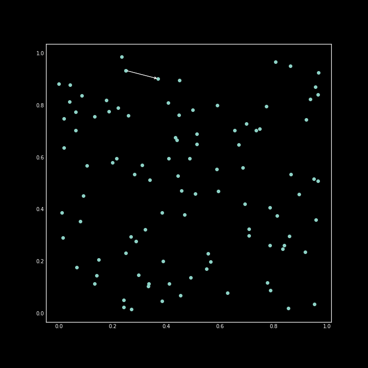
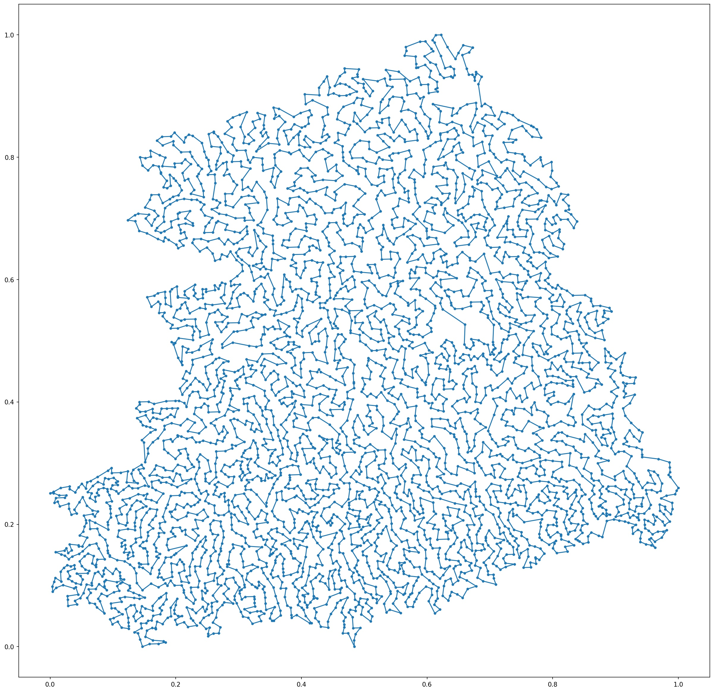

# Hybrid Pointer Networks
Sep, 2021

### Description
PyTorch implementation of "The Transformer Network for the Traveling Salesman Problem" 
Xavier Bresson and Thomas Laurent 
ArXiv : [https://arxiv.org/pdf/2103.03012.pdf](https://arxiv.org/pdf/2103.03012.pdf)  
 
 
 
 
 
 

 
 

### Benchmark
Sample instance form TSBLIB benchmark data fnl4461 

 
 
 
 
 
 

### Guidelines
1. Network Training (Tesla P100-PCIE-16GB)  
TSPSmall  : Inside small folder 
TSPLarge  : inside large folder 
2. Network Testing  
TSPSmall : Run notebook hpn-smallsize-test. 
TSPLarge : Run notebook hpnlarge-test. 
3. The Checkpoint file beside each training notebook 
 

 
 
 

